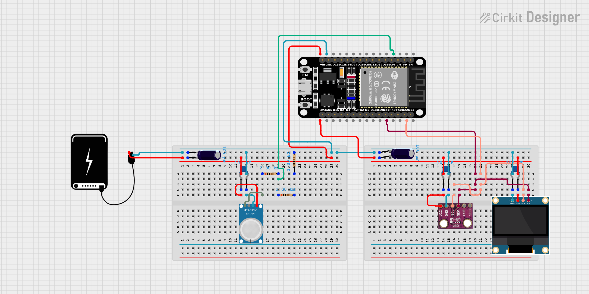

# Hardware - Stacja Pogodowa

Ten katalog zawiera dokumentację techniczną, schematy połączeń oraz listę niezbędnych elementów (BOM) do zbudowania fizycznej warstwy Inteligentnej Stacji Pogodowej.

## 📸 Podgląd Układu

## 🧩 Lista Materiałów (BOM)

Poniżej znajduje się lista komponentów wymaganych do budowy urządzenia.

| Element | Model / Wartość | Ilość | Uwagi |
| :--- | :--- | :--- | :--- |
| **Mikrokontroler** | ESP32 DevKit V1 | 1 | Wersja 30-pin (układ WROOM-32) |
| **Wyświetlacz** | OLED 0.96" I2C | 1 | Sterownik SSD1306, rozdzielczość 128x64 |
| **Czujnik 1** | BME280 | 1 | Temp/Wilg/Ciśnienie (3.3V, I2C: 0x76) |
| **Czujnik 2** | MQ-135 | 1 | Jakość powietrza (5V, Analog) |
| **Rezystory** | 2kΩ oraz 1kΩ | 2+ | Do budowy dzielnika napięcia (suma 3kΩ + 2kΩ) |
| **Kondensatory** | 100µF (Elektrolit) | 2 | Stabilizacja linii zasilania 5V i 3.3V |
| **Kondensatory** | 100nF (Ceramiczny) | 3 | Odsprzęganie zakłóceń przy każdym module |
| **Zasilanie** | Powerbank / Ładowarka | 1 | Wyjście 5V USB |
| **Inne** | Płytka stykowa, Kable | - | Jumper wires (Męsko-Męskie / Męsko-Żeńskie) |

---

## 🔌 Schemat Połączeń (Pinout)

Magistrala **I2C** jest współdzielona przez czujnik BME280 oraz wyświetlacz OLED.

| Pin ESP32 | Funkcja | Podłączony do | Uwagi |
| :--- | :--- | :--- | :--- |
| **VIN (5V)** | Wejście Zasilania | Powerbank (+) | Zasilanie całego układu |
| **GND** | Masa | Wspólna masa | **Krytyczne:** połącz masy wszystkich modułów! |
| **3V3** | Wyjście 3.3V | VCC (BME280 + OLED) | Zasilanie logiki 3.3V |
| **D21** | SDA (I2C) | SDA (BME280 + OLED) | Linia danych |
| **D22** | SCL (I2C) | SCL (BME280 + OLED) | Linia zegara |
| **D34** | ADC (Wejście) | AOUT (MQ-135) | **UWAGA:** Przez dzielnik napięcia! |

---

## ⚠️ Ważne Uwagi Techniczne

### 1. Dzielnik Napięcia dla MQ-135
Czujnik MQ-135 pracuje na napięciu **5V** i może wystawić na wyjściu analogowym (AOUT) napięcie do 5V. Mikrokontroler ESP32 toleruje na wejściach maksymalnie **3.3V**.

Aby nie spalić pinu `D34`, zastosowano dzielnik napięcia:
* **Rezystor R1 (Górny):** 2.0 kΩ
* **Rezystor R2 (Dolny):** 3.0 kΩ (złożony z 2kΩ + 1kΩ szeregowo)

**Wynik:**
Maksymalne napięcie na wejściu ESP32 wynosi bezpieczne **3.0V**.
> Wzór: `Vout = 5V * (3000 / (2000 + 3000)) = 3V`

### 2. Stabilizacja Zasilania
Ze względu na skoki prądu generowane przez grzałkę w czujniku MQ-135 oraz moduł WiFi w ESP32, układ wymaga dobrej filtracji:
* **Kondensatory 100µF:** Wpięte równolegle do szyn zasilania głównego (5V oraz 3.3V).
* **Kondensatory 100nF (0.1µF):** Wpięte bezpośrednio przy nóżkach zasilania każdego modułu (VCC-GND) w celu redukcji szumów wysokiej częstotliwości.

### 3. Zasilanie Czujników
* **MQ-135:** Musi być zasilany z **5V** (bezpośrednio z Powerbanku/VIN), w przeciwnym razie grzałka nie osiągnie temperatury roboczej.
* **BME280 / OLED:** Muszą być zasilane z **3.3V** (z pinu 3V3 ESP32), aby nie uszkodzić logiki I2C.

---

## 🛠️ Wymagane Narzędzia
* Lutownica i cyna (jeśli nie używasz płytki stykowej).
* Multimetr (do sprawdzenia napięć przed pierwszym uruchomieniem).
* Przewody połączeniowe.
